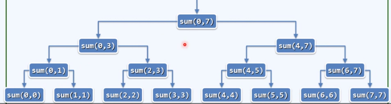
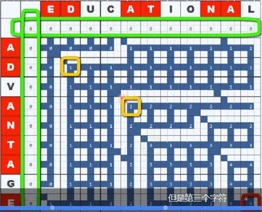
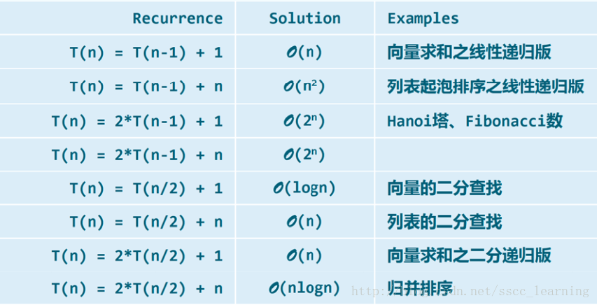

## 算法分析

- 算法分析的两个主要任务：正确性（不变性+单调性 ） + 复杂度

- 算法复杂度分析的主要方法：
  - 迭代：级数求和
  - 递归：递归跟踪 +递推方程
  - 猜测＋验证

## 符号定义

$T(n)=\Omega(f(n)):$
$\exists c>0,$ 当 $n>>2$ 后, $,$ 有 $T(n)>c \cdot f(n)$


$T(n)=\Theta(f(n)):$
$\exists c_{1}>c_{2}>0,$ 当 $n>>2$ 后, 有 $c_{1} \cdot f(n)>T(n)>c_{2} \cdot f(n)$


### 基本数学知识 （复杂度必备）

1. 算数级数： 与末项平方同阶

   $$T(n)=1+2+\ldots+n=n(n+1) / 2=O\left(n^{2}\right)$$

2. 幂方级数：比幂次高一阶：$\sum_{\mathrm{k}=0}^{n} \boldsymbol{k}^{d} \approx \int_{0}^{n} x^{d+1} d x=\left.\frac{1}{d+1} x^{d+1}\right|_{0} ^{n}=\frac{1}{d+1} n^{d+1}=O\left(n^{d+1}\right)$

   $T_{2}(n)=1^{2}+2^{2}+3^{2}+\dots+n^{2}=n(n+1)(2 n+1) / 6=O\left(n^{3}\right)$
   $T_{3}(n)=1^{3}+2^{3}+3^{3}+\dots+n^{3}=n^{2}(n+1)^{2} / 4=O\left(n^{4}\right)$
   $T_{4}(n)=1^{4}+2^{4}+3^{4}+\ldots+n^{4}=n(n+1)(2 n+1)\left(3 n^{2}+3 n-1\right) / 30=O\left(n^{5}\right)$

   ...

3. 几何级数（a>1）: 与末项同阶

   $T_{a}(n)=a^{0}+a^{1}+\dots+a^{n}=\left(a^{n+1}-1\right) /(a-1)=O\left(a^{n}\right)$
   $1+2+4+\ldots+2^{n}=2^{n+1}-1=O\left(2^{n+1}\right)=O\left(2^{n}\right)$

4. 收敛级数

   $1/1 / 2+1 / 2 / 3+1 / 3 / 4+\ldots+1 /(n-1) / n=1-1 / n=0(1)$

5. 可能未必收敛，但长度有限

   $h(n)=1+1 / 2+1 / 3+\ldots+1 / n=\Theta(\log n)$   // **调和级数**

   $\log 1+\log 2+\log 3+\ldots+\log n=\log (n !)=\Theta(n \log n)$ //**对数级数**

   // 对数的和，等于这些数字的乘积的对数，再利用斯特林公式进行逼近

   //  斯特林公式： $n ! \approx \sqrt{2 \pi n}\left(\frac{n}{e}\right)^{n}$

   ###  算法正确性的证明：以气泡排序为例

   - 不变性：经k轮扫面交换后，最大的k个元素必然就为
   - 单调性：经k轮扫描交换后，问题规模缩减至n-k
   - 正确性：经最多n趟扫描后，算法必然终止，且能给出正确的解答

   ### 封底估算 Back-of-the-envelope Calculation

   - 建立对常用量纲的直观认识：
     - 1day = 24 hr * 60min * 60 sec $\sim$ 25 * 4000 = 10^5 sec
     - 普通PC 1GHz 10^9 flops
     - 天河1A 1P = 10^15 flops
     - $\Phi^{36}=2^{25}$ ，$\Phi$是fib数， $\frac{\sqrt{5}+1}{2} $

## 迭代与递归

### 递归的复杂度分析

- 迭代追踪

- 递推方程

  - 例子：

  - 已知递推方程：

    $T(n)=T(n-1)+O(1)$
    $T(0)=O(1)$  //递归基，只有存在递归基，递归才不会一直进行下去

    求解： 

    $\begin{aligned} T(n)-n &=T(n-1)-(n-1)=\ldots \\ &=T(2)-2 \\ &=T(1)-1 \\ &=T(0) \end{aligned}$

复杂度分析实例：数组求和（二分递归）

```cpp
sum(int A[], int lo. int hi) { //区间范围A[lo, hi]
    if(lo==hi) return A[lo];
    int mi = (lo + hi) >> 1;
    return sum(A, lo, mi) + sum(A, mi+1, hi);
}//入口形式为 sum(A, 0, n-1);
```

1. 递归跟踪分析法



去掉递归调用的开销， 每一个block/递归实例大概需要$O(1)$.

$\begin{aligned} \mathbf{T}(n) &=\text { 各层递归实例所需时间之和 } \\ &=0(1) \times\left(2^{0}+2^{1}+2^{2}+\ldots+2^{logn}\right) \\ &=O(1) \times\left(2^{log n+1}-1\right)=O(n) \end{aligned}$

或者底层的递归实例，从渐进的意义上讲，已经可以代表整体的数量了

2. 递推方式分析

   从递推的角度分析，为求解sum(A,lo,hi), 需

   递归求解sum(A, lo, mi) 和 sum(A, mi+1, hi)				// 2*T(n/2)

   进而将子问题的解累加                                                // O(1)

   递归基: sum(A, lo, lo) 												// O(1)

   - 故而有递推关系式：

     $T(n)=2 * T(n / 2)+O(1)$
     $T(1)=O(1)$

   - 求解：

   - $\begin{aligned} T(n) &=2 * T(n / 2)+c_{1} \\ T(n)+c_{1} &=2 *\left(T(n / 2)+c_{1}\right)=2^{2 }*\left(T(n / 4)+c_{1}\right.\\ &=\cdots \\ &=2^{\log n}\left(T(1)+c_{1}\right)=n*\left(c_{2}+c_{1}\right) \\ &=\left(c_{1}+c_{2}\right) n-c_{1}=(O(n)) \end{aligned}$

     ／／　上述求解过程中，为方便理解，可以讲　$T(n)+c_1$ 做一个整体的替换


## 动态规划

可以等效的认为是通过递归找到算法的本质 (make it work)，再等效的将其转化为迭代的形式(make it fast).

### 斐波那契数列

1. Memorization 记忆：将已计算过实例的结果制表备查
2. DP 颠倒计算方向，由自顶而下递归，改为自底而上迭代

```cpp
f = 0, g = 1; (fib(0), fib(1))
while( 0 < n--)
{
    g = g + f；
    f = g - f;
}
return g;
```

### 最长公共子序列 Longest Common Subsequence

1. 递归分析

   每一组可能解都对应在下面这张由递归实例的调用绘制出的图片中的一条连接左上角和右下角的路径



最坏的情况下，原问题分解为两个（规模接近一致）的两个字问题，此时$L C S(A[0, a], B[0, b])$的调用次数为：

$\left(\begin{array}{c}n+m-a-b \\ n-a\end{array}\right)=\left(\begin{array}{c}n+m-a-b \\ m-b\end{array}\right)$

(可以直观理解为，从(n,m)点找到一条到达(a,b)点的路径

2. 迭代分析
   1. 将所有子问题列成一张表
   2. 颠倒计算方向，从LCS(A[0], B[0])出发，依次计算出所有项

## 递归常见复杂度

