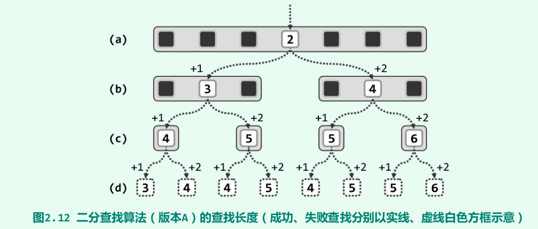
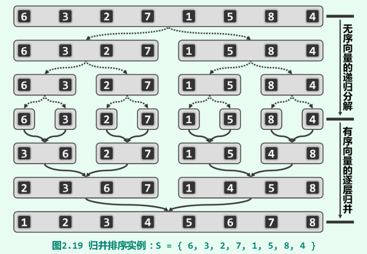
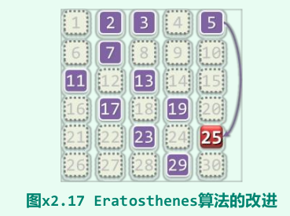

# 二、向量

线性结构统称为序列 sequence，又根据数据项的逻辑次序与其物理存储地址的对应关系，进一步分为向量 vector 和列表 list。

1. 向量：物理存放位置与逻辑次序吻合，此时的逻辑次序也称为秩 rank。
2. 列表：逻辑上相邻的数据项在物理上未必相邻。

## 从数组到向量

C 等语言中的数组能组织相同类型的数据项，并用下标存取数据项。元素的物理地址和下标满足线性关系，故称为线性数组 linear array。

向量是线性数组的一种抽象和泛化，它也是由具有线性次序的一组元素构成的集体， $ V = \{ V_0, V1, \cdots, V_{n-1} \}$，其中的元素分别由秩 (rank) 相互区别（相当于下标）。各元素的秩互异，且均为 [0, n) 内的整数，若元素 e 有 r 个前驱元素，则其秩为 r。通过 r 亦可唯一确定 $e = V_r$，称为 **循秩访问 call-by-rank**。

向量实际规模 **size** 与其内部数组容量 **capacity** 的比值 **size/capacity** 称装填因子 load factor，用来衡量空间利用率。

## 静态空间管理

若采用静态空间管理，容量_capacity固定，有着明显的不足：

- **上溢(overflow)** 不足以存放所有元素，尽管此时系统仍有足够的空间
- **下溢(underflow)** 存放的元素寥寥无几，装填因子(load factor)<<50%


## 可扩充向量


满员时进行插入操作，会自动扩容为原数组为两倍。

```cpp
template <typename T> void Vector<T>::expand() { //向量空间不足时扩容
    if (_size < _capacity)
        return; //尚未满员时，不必扩容

	_capacity = max(_capacity, DEFAULT_CAPACITY);//不低于最小容量

    T* oldElem = _elem;
    _elem = new T[_capacity <<= 1]; //容量加倍
    for (int i=0; i<_size; i++)
        _elem[i] = oldElem[i]; //复制原向量内容，T 为基本类型，或已重载赋值操作符 '='

    delete [] oldElem; //释放原空间
}
```

### 分摊分析

自动扩容时的插入操作，时间代价为 O(2n)=O(n)，但之后至少要再经过 n 次插入后，才会再次扩容操作，故分摊复杂度不高。

足够多次连续操作后，将期间消耗的时间分摊至所有的操作，分摊平均至单次操作的时间成本，称为分摊运行时间 (amortized running time)，它与平均运行时间（average running time) 有本质不同，后者是按照某种假定的概率分布，对各情况下所需执行时间的加权平均，故亦称为期望运行时间（expected running time);前者则要求，参与分摊的操作必须构成和来自一个真实可行的操作序列，且该序列还必须足够长。

### 分摊时间为 O(1)

考虑最坏情况，即都是插入操作，定义：

+ size(n) = 连接插入 n 个元素后向量的规模
+ capacity(n) = 连接插入 n 个元素后向量的容量
+ T(n) = 为连续插入 n 个元素而花费于扩容的时间
+ N 为初始容量

则 size(n) = N + n，既然不溢出，则装填因子不超过 100%，同时，只在满员时将容量加倍，则因子不低于 50%，则：

$size(n) \le capacity(n) \lt 2 \bullet size(n)$

因此，capacity(n) 和 size(n) 同阶： $capacity(n) = \Theta(size(n)) = \Theta(n)$

容量以 2 为比例按指数增长，在容量达到 capacity(n) 前，共做过 $\Theta(log_2n)$ 次扩容，每次扩容时间线性正比于当时的容量（或规模），故扩容累计时间：

$T(n) = 2N + 4N + 8N + \cdots + capacity(n) < 2 \bullet capacity(n) = \Theta(n)$

单次分摊运行时间为 O(1)


### 其它扩容策略

早期采用追加固定数目的单元，在最坏情况下，分摊时间的下界为 $\Omega(n)$

## 缩容

```cpp
template <typename T> void Vector<T>::shrink(){ //装填因子过小时压缩向量所占空间
    if (_capacity < DEFAULT_CAPACITY<<1) //不致收缩到 DEFAULT_CAPACITY 以下
        return;

    if (_size<<2 > _capacity) // 以 25% 为界，大于 25% 时不收缩
        return;

    T* oldElem = _elem;
    _elem = new T[_capacity >>= 1]; //容量减半
    for (int i=0; i<_size; i++)
        _elem[i] = oldElem[i];

    delete [] oldElem;
}
```

这里缩容阈值是 25%，为避免出现频繁交替扩容和缩容，可选用更低的阈值，甚至取 0（禁止缩容）。分摊时间也是 O(1)。


## 向量整体置乱算法 permute()

```cpp
template <typename T> void permute(Vector<T>& V) { //随机置乱向量，使各元素等概率出现于每一位置
    for (int i=V.size(); i>0; i--) //自后向前
        swap(V[i-1], V[rand() % i]); //V[i-1] 与 V[0, i) 中某一随机元素交换，rand() 返回 0~MAX之间的整数
}
```


## 无序查找


```cpp
template <typename T> //无序向量的顺序查找，返回最后一个元素 e 的位置;失败时返回 lo-1
Rank Vector<T>::find(T const& e, Rank lo, Rank hi) const {  //在 [lo, hi) 内查找
    //assert: 0 <= lo < hi <= _size
    while ((lo < hi--) && (e != _elem[hi]))
        ; // 自后向前，顺序查找
    return hi; //若 hi<lo, 则意味着失败; 否则 hi 即命中元素的秩
}
```

复杂度最坏情况是 O(hi-lo)=O(n)，最好情况是 O(1)，故为输入敏感的算法。


## 在 r 位置插入


```cpp
template <typename T> //将 e 作为秩为 r 的元素插入
Rank Vector<T>::insert(Rank r, T const& e) {
    //assert: 0 <= r <= size
    expand(); //若有必要， 扩容
    for (int i=_size; i>r; i--)
        _elem[i] = _elem[i-1]; //自后向前， 后继元素顺序后移一个单元

    _elem[r] = e; 
    _size++;
    return r;
}
```

复杂度为 O(n)。

## 删除 V[lo, hi)


```cpp
template <typename T> int Vector<T>::remove(Rank lo, Rank hi) { //删除区间 [lo, hi)
    if (lo == hi) 
        return 0; //出于效率考虑，单独处理退化情况，比如 remove(0, 0)

    while (hi < _size)
        _elem[lo++] = _elem[hi++]; // [hi, _size] 顺次前移 hi-lo 个单元

    _size = lo; // 更新规模，直接丢弃尾部 [lo, _size=hi) 区间
    shrink(); //若有必要，则缩容
    return hi-lo; //返回被删除元素的数目
}
```

复杂度主要消耗于后续元素的前移，线性正比于后缀的长度。


## 无序向量去重（唯一化）


```cpp
template <typename T> int Vector<T>::deduplicate(){ //删除无序向量中重复元素（高效版本）
    int oldSize = _size;
    Rank i = 1; //从 _elem[1] 开始
    while (i < _size) //自前向后逐一考查各元素 _elem[i]
        (find(_elem[i], 0, i) < 0) ? //在其前缀中寻找与之雷同者（至多一个）
            i++ : remove(i); //若无雷同则继续考查其后续，否则删除雷同者

    return oldSize - _size; //向量规模变化量，即被删除元素总数
}
```

每次迭代时间为 O(n),总体复杂度 $O(n^2)$。


## 有序向量去重 (唯一化）

### 低效版本

```cpp
//有序向量重复元素删除算法（低效版本）
template <typename T> int Vector<T>::uniquify(){
    int oldSize = _size;
    int i = 1;
    while (i<_size) //自前向后，逐一比对各对相邻元素
        _elem[i-1] == _elem[i] ? remove[i] : i++; //若雷同，则删除后者; 否则转到后一元素
    return oldSize-_size; //返回删除元素总数
}
```


极端情况下（即元素都相同时），remove() 操作的时间问题： $(n-2)+(n-3)+ \cdots + 2+1=O(n^2)$

### 改进

以上版本复杂度过高根源在：相邻的相同元素都是一个一个删除的，不是一次性连续删除。

由于有序，**每组重复元素都必然前后紧邻集中分布，故可整体删除​**。


高效版本：

```cpp
//有序向量重复元素删除算法（高效版本）
template <typename T> int Vector<T>::uniquify(){
    Rank i = 0, j = 0; //各对互异 "相邻“ 元素的秩
    while (++j < _size) //逐一扫描，直到末元素
        if (_elem[i] != _elem[j]) //跳过雷同者
            _elem[++i] = _elem[j]; //发现不同元素时，向前移至紧邻于前者右侧

    _size = ++i; //直接截除尾部多余元素
    shrink();
    return j - i; //返回删除元素总数
}
```


算法复杂度是 O(n)。

## 有序向量的查找

### 语义约定：

方便后续插入操作：V.insert(1+V.search(e),e) 即便查找失败，也应该使得插入不影响后续的有序性

在有序向量区间V[lo. hi) 中，确定**不大于e的最后一个元素**的秩

- 若e<V[lo]，则返回lo-1
- 若V[hi-1] <ｅ，则返回ｈi-1 


### 减而治之，二分查找（版本A）


```cpp
//二分查找版本A：在有序向量的区间 [lo, hi) 内查找元素 e, 0 <= lo <= hi <= _size
template <typename T> static Rank binSearch(T* A, T const& e, Rank lo, Rank hi) {
    while (lo < hi) { //每步迭代可能要做两次比较判断，有三个分支
        Rank mi = (lo + hi) >> 1; //以中点为轴点
        if (e < A[mi]) 
            hi = mi; //深入前半段 [lo, mi)继续查找
        else if (A[mi] < e)
            lo = mi + 1; //深入后半段
        else
            return mi; //在 mi 处命中
    } //成功查找可以提前终止
    return -1; //查找失败
} //有多个命中元素时，不能保证返回秩最大者； 查找失败时，简单返回 -1， 而不能指示失败的位置
```

最多 $log_2(hi-lo)$ 次迭代，时间复杂度 O(logn)

### 查找长度 search length

指查找算法中元素大小比较操作的次数。



二分查找时，查找过程（模式）一致，因此每个元素的查找长度只与该元素的秩和总长度有关，与元素的具体值无关。

长度为 $n=2^k-1$ 的有序向量，平均成功查找长度为 $O(1.5k)=O(1.5log_2n)$

查找失败时必有 `lo>=hi`，其时间复杂度为 $\Theta(logn)$，平均失败查找长度也为 $O(1.5k)=O(1.5log_2n)$

二分查找时，进入左侧树只要 1 次比较，而进入右侧树要 2 次比较，因此不平衡，从而会出现 1.5 系数。

###  Fibonacci 查找，按黄金分割比确定 mi


该算法会拉长 1 次比较的子向量（左侧树），缩短 2 次比较的子向量（右侧树），从而减少平均查找长度。

```cpp
// Fibonacci 查找版本A：在有序向量的区间 [lo, hi) 内查找元素 e, 0 <= lo <= hi <= _size
template <typename T> static Rank fibSearch(T* A, T const& e, Rank lo, Rank hi) {
    Fib fib(hi-lo); //用 O(log_phi(hi-lo) 时间创建 Fib 数列，值不大于 hi-lo
    while (lo < hi) { //每步迭代可能要做两次比较，有三个分支
        while (hi-lo < fib.get())
            fib.prev(); //通过向前顺序查找（分摊O(1)) 
        Rank mi = lo + fib.get() - 1; //确定形如 Fib(k)-1 的轴点
        if (e < A[mi])
            hi = mi;
        else if (A[mi] < e)
            lo = mi + 1;
        else
            return mi; //命中
    } //成功查找可以提前终止
    return -1; //查找失败
} //有多个命中元素时，不能保证返回秩最大者； 查找失败时，简单返回 -1， 而不能指示失败的位置
```

平均查找长度为 $1.44log_2n$，常系数上有改善。

### 二分查找（版本 B）

从三分支改为两分支，从而使两分的子向量的比较次数都为 1，在切分点 mi 处只任一次 `<` 比较，判断成功进入前端 A[lo, mi) 继续，否则进入后端 A[mi, hi) 继续。


```cpp
//二分查找版本B：在有序向量的区间 [lo, hi) 内查找元素 e, 0 <= lo <= hi <= _size
template <typename T> static Rank binSearch(T* A, T const& e, Rank lo, Rank hi) {
    //循环在区间不足两个时中止
    while (1 < hi-lo) { //每步迭代仅做一次比较判断，有两个分支;成功查找不能提前终止
        Rank mi = (lo + hi) >> 1; //以中点为轴点
        (e < A[mi]) ? hi = mi : lo = mi; //经比较后确定深入 [lo, mi) 或 [mi, hi)
    } // 出口时 lo+1 == hi, 即区间中只剩下一个元素 A[lo]
    return (e == A[lo]) ? lo : -1; //查找成功时返回对应的秩，否则统一返回 -1 
} //有多个命中元素时，不能保证返回秩最大者； 查找失败时，简单返回 -1， 而不能指示失败的位置
```

命中时不能及时返回，最好情况下效率有倒退，作为补偿，最坏情况下效率有提高，因此各分支的查找长度更接进，整体性能更趋稳定（好）。


### 二分查找 （版本 C），返回的结果方便进行插入操作

+ 当有多个命中元素时，必须返回最靠后（秩最大）者
+ 失败时，应返回小于 e 的最大都（仿哨兵 A[lo-1])

```cpp
//二分查找版本C：在有序向量的区间 [lo, hi) 内查找元素 e, 0 <= lo <= hi <= _size
template <typename T> static Rank binSearch_VC(T* A, T const& e, Rank lo, Rank hi) {
    while (lo < hi) { //每步迭代仅做一次比较判断，有两个分支
        Rank mi = (lo + hi) >> 1; //以中点为轴点
        (e < A[mi]) ? hi = mi : lo = mi + 1; //经比较后确定深入 [lo, mi) 或 (mi, hi)
    } //成功查找不能提前终止
    return --lo; //循环结束时，lo 为大于 e 的元素的最小秩，故 lo-1 即不大于 e  的元素的最大秩
} //有多个命中元素时，总能保证返回秩最大者;查找失败时，能够返回失败的位置
```


算法正确性通过数据归纳为：其循环体具有如下不变性：

**A[0, lo) 中的元素皆 <= e; A[hi, n) 中的元素皆 > e**

1. 当 lo=0 且 hi=n 时，A[0, lo) 和 A[hi, n) 均空，不变性自然成立。
2. 在上图 (a) 中，设某次进入循环时以上不变性成立，以下有两种情况：
3. 当 `e<A[mi]` 时，如 (b) 中，令 hi=mi，则右侧（包含 mi元素）的 A[hi, n) 中的元素都 `>=A[mi]` 即 `>e`。
4. 反之，当 `e>=A[mi]` 时，如 (c)中，令 lo=mi+1，则左则（包含 mi 元素）的 A[0, lo) 中的元素都 `<=A[mi]` 即 `<=e`。从而不变性必然延续。
5. 循环终止时，lo=hi, 考查此时元素 A[lo-1], A[lo]: 作为 A[0, lo) 的最后一个元素， `A[lo-1] <= e`，作为 A[lo, n) = A[hi, n) 内的第一个元素，`e < A[lo]`，从而返回 `lo-1` 即为向量中不大于 e 的最大秩。


### 插值查找 interpolation Search

假设有序向量中各元素均匀且独立分布，查找时分隔轴点 mi 根据查找值动态计算，从而提高收敛速度。


平均情况：每经一次比较，查找范围从 n 缩短为 根号 n。O(loglogn)。

与其它查找算法比较，优势不太明显。

综合使用：

+ 在大规模情况下：用插值查找快速缩小规模
+ 中规模：折半查找
+ 小规模：顺序查找


## 复杂度下界 lower bound

即最坏情况下的最低成本(worst-case optimal)。

### 比较树

将基于比较的分支画出比较树。


+ 每一内部节点对应一次比对操作。
+ 内部节点的分支，对应比对下的执行方向。
+ 叶节点对应于算法某次执行的完整过程及输出。
+ 算法的每一次运行过程都对应于从根到某一叶节点的路径。

基于比较的算法(散列等除外）都是 comparison-based algorithm，即 CBA 算法。

从而将 CBA 算法的下界问题转为对应比较树的界定问题。

算法的每一运行时间，取决于对应叶节点到根节点的距离（称作叶节点的深度），而最坏情况下的运行时间，取决于所有叶节点的最大深度（即树的高度）。

一个 CBA 算法对应一棵比较树，从而下界即为所有比较树的最小高度）。

在一个高度为 h 的二叉树中，叶结点不可能多于 $2^h$，反过来，若某一问题的输出结果（即叶结点）不于少 N 种，则树高不可能低于 $log_2N$。

从而下界即与输出的结果数目 N 相关。


## 排序


### 排序的下界

CBA 式排序算法中，当有 n 个元素时，可能输出有 N = n! 种，比较树是三叉树（对应小于、相等、大于），从而高度为 $log_3 (n!)$ 的上确，从而 排序算法的下界为 $\Omega(log_3(n!)) = \Omega(nlogn)$。桶排序和基数排序不是 CBA 算法，不基于比较树，从而不是该下界。

### 起泡排序

```cpp
template <typename T> //向量的起泡排序
void Vector<T>::bubbleSort(Rank lo, Rank hi) //assert: 0 <= lo < hi <= size
{
    while(!bubble(lo, hi--)) //逐趟扫描交换，直到全序
        ; // pass
}

template <typename T> bool Vector<T>::bubble(Rank lo, Rank hi) { //一趟扫描交换
    bool sorted = true; //整体有序标志
    while (++lo < hi) //自左向右，逐一检查各对相邻元素
        if (_elem[lo-1] > _elem[lo]) { //若逆序，则
            sorted = false; //意味着尚末整体有序，并需要
            swap(_elem[lo-1], _elem[lo]);
        }
    return sorted;
}
```

算法中只有相邻元素的前一个大于后者时，能会交换，保证了重复元素间的相对次序在排序前后的一致，即算法具有稳定性。

```cpp
//优化的起泡排序
//每趟扫描后，记录最右侧的逆序对位置，
//从而下趟可直接忽略后面已经就序的元素
template <typename T>
void Vector<T>::bubbleSort2(Rank lo, Rank hi)
{
    while (lo < (hi = bubble2(lo, hi)))
        ; //pass
}

template <typename T> Rank Vector<T>::bubble2(Rank lo, Rank hi) {
    Rank last = lo; //最右侧的逆序对初始化为 [lo-1, lo]
    while (++lo < hi) //自左向右，逐一检查各对相邻元素
        if (_elem[lo-1] > _elem[lo]) { //若逆序，则
            last = lo; //更新最右侧逆序对位置
            swap(_elem[lo-1], _elem[lo]);
        }
    return last;
}
```

### 归并排序

有序向量的二路归并 (2-way merge)，将两有有序序列合并成为一个有序序列：

迭代进行，每次迭代时只比较两个序列的首元素，将小者取出放在输出序列末尾。最后将另一个非空的向量整体接到输出向量的末尾。


```cpp
template <typename T> //向量归并排序
void Vector<T>::mergeSort(Rank lo, Rank hi) { // 0 <= lo < hi <= size
    if (hi-lo < 2) //单元素区间自然是有序
        return;

    int mi = (lo+hi) >> 1; //中点为界
    mergeSort(lo, mi); mergeSort(mi, hi); //分别对前后半段排序
    merge(lo, mi, hi); //归并
}

template <typename T> //有序向量的归并
void Vector<T>::merge(Rank lo, Rank mi, Rank hi){ //以 mi 为界，合并有序子向量 [lo, mi), [mi, hi)
    T* A = _elem + lo; //前子向量的首地址，合并后的结果地址也从这开始

    int first_len = mi-lo;
    T* B = new T[first_len]; //用于临时存放前子向量
    for (Rank i=0; i<first_len; B[i] = A[i++])
        ; //pass

    int second_len = hi-mi;
    T* C = _elem + mi; //后子向量的首地址

    for (Rank i=0, j=0, k=0; (j<first_len) || (j<second_len); ){ //将 B[j] 和 C[k] 中的小者续至 A 末尾

        // 前子向量还有元素未处理时，
        //   1. 如果后子向量已经处理完毕，或者
        //   2. 其第一个元素小于后子向量的第一个元素
        if ( (j<first_len) && ( !(k<second_len) || (B[j]<=C[k]) ) )
            A[i++] = B[j++];

        // 后子向量还有元素未处理时，
        //   1. 如果前子向量已经处理完毕，或者
        //   2. 其第一个元素小于前子向量的第一个元素
        if ( (k<second_len) && ( !(j<first_len) || (C[k] < B[j]) ) )
            A[i++] = C[k++];
    }

    delete [] B;
} //归并后得到完整的有序向量 [lo, hi)
```


二路归并时间与归并元素个数成线性关系，为 O(n)。

整体排序时，分而治之共分了 $log_2n$ 层，每层的 n 个元素进行归并，因此复杂度为 O(nlogn)。




二路归并的精简实现：

由于后子向量本身就位于结果向量后，如果前子向量提前处理完后，对后子向量的复制操作无需进行：


## 位图

习题 [2-34] 位图(Bitmap)是一种特殊癿序列结极,可用以劢态地表示由一组(无符号)整数极成癿集合。
其长度无限,且其中每个元素癿叏值均为布尔型(刜始均为 false)。

```cpp
//习题 2-34 位图 Bitmap b)
class Bitmap {
    private:
        char* M; int N; //比特图所存放的空间 M[], 容量为 N * sizeof(char) * 8 比特。

    protected:
        void init(int n) {
            M = new char[N = (n+7)/8]; //申请能容纳 n 个比特的最少字节
            memset(M, 0, N);
        }

    public:
        Bitmap(int n=8) {
            init(n);
        }

        Bitmap(char* file, int n=8) { //从指定文件中读取比特图
            init(n);
            FILE* fp = fopen(file, "r");
            fread(M, sizeof(char), N, fp);
            fclose(fp);
        }

        ~Bitmap() {
            delete [] M;
            M = NULL;
        }

        void set(int k){ //将第 k 位置设置为 true
            expand(k);

            /*
             * k>>3 确定该位在哪个字节
             * k&0x07 确定字节中的位置
             * （0x80 >> (k & 0x07)) 将字节中的该位置 1
             */
            M[k >> 3] |= (0x80 >> (k & 0x07) );
        }

        void clear(int k){ //将第 k 位置设置为 false
            expand(k);

            /*
             * k>>3 确定该位在哪个字节
             * k&0x07 确定字节中的位置
             * (0x80 >> (k & 0x07)) 将字节中的该位置 1
             * ~(0x80 >> (k & 0x07)) 将字节中的该位置 0
             */
            M[k >> 3] &= ~(0x80 >> (k & 0x07));
        }

        bool test(int k){ //测试第 k 位是否为 true
            expand(k);

            /*
             * k>>3 确定该位在哪个字节
             * k&0x07 确定字节中的位置
             * （0x80 >> (k & 0x07)) 将字节中的该位置 1
             */
            return M[k >> 3] & (0x80 >> (k & 0x07) );
        }

        void dump(char* file) { //将位图整体导出至指定的文件，以便以后的新位图批量初始化
            FILE* fp = fopen(file, "w");
            fwrite(M, sizeof(char), N, fp);
            fclose(fp);
        }

        char* bits2string(int n) { //将前 n 位转换为字符串
            expand(n-1); //此时可能被访问的最高位为 bit[n-1]
            char* s = new char[n+1];
            s[n] = '\0'; //字符串所占空间，由上层调用者负责释放
            for (int i=0; i<n; i++)
                s[i] = test(i) ? '1' : '0';
            return s;
        }

        void expand(int k) { //若被访问的 Bitmap[k] 已出界，则需扩容
            if (k < 8*N)
                return;
            int oldN = N;
            char* oldM = M;
            init(2*k); //与向量类似，加倍策略
            memcpy(M, oldM, oldN);
            delete [] oldM;
        }
};

    //习题 [2-34] Bitmap b) 测试
    cout << "Bitmap test:" << endl;
    Bitmap bitmap = Bitmap();
    bitmap.set(0);
    bitmap.set(1);
    bitmap.set(9);
    cout << "Bitmap:" << bitmap.bits2string(15) << endl; //110000000100000

```

以上实现中，要花费时间初始化，通过空间换时间，下面的实现能节省初始化所有元素所需的时间。

```cpp
//习题 2-34 c)
//创建 Bitmap 对象时，如何节省下为初始化所有元素所需的时间？
//设位置只需提供 test() 和 set() 接口，暂时不需要 clear() 接口，
class Bitmap_without_init { //以空间换时间，仅允许插入，不支持删除
    private:
        Rank* F; Rank N; //规模为 N 的向量 F，
        Rank* T; Rank top; //容量为 N 和栈

    protected:
        inline bool valid(Rank r){ return (0 <= r) && (r < top); }

    public:
        Bitmap_without_init(Rank n=8) {
            N = n;
            F = new Rank[N]; T = new Rank[N]; // 在 O(1) 内隐式地初始化
            top = 0; 
        }

        ~Bitmap_without_init(){ delete [] F; delete [] T; }

        //接口
        inline void set(Rank k) {
            if (test(k))
                return;
            //要设置的位置 k，对应的 F[k] 处将值设置为栈的栈顶指针，
            //同时在栈中将栈顶指针处将值设置为 k，建立校验环
            //从而当要 test k 位置时，取出对应的 F[k] 处的值，即为当时
            //保存的栈顶指针，再从栈中取出值，如果值和 k 相同，则
            // k 位有设置值。
            T[top] = k; F[k] = top; ++top; //建立校验环
        }

        inline bool test(Rank k) {
            return valid(F[k]) && ( k == T[ F[k] ] );
        }

        char* bits2string() { //将前 n 位转换为字符串
            char* s = new char[N+1];
            s[N] = '\0'; //字符串所占空间，由上层调用者负责释放
            for (int i=0; i<N; i++)
                s[i] = test(i) ? '1' : '0';

            return s;
        }

};

    //习题 [2-34] 无需初始化时间的 Bitmap c) 测试
    cout << "Bitmap_without_init test:" << endl;
    Bitmap_without_init bitmap2 = Bitmap_without_init(10);
    bitmap2.set(0);
    bitmap2.set(1);
    bitmap2.set(9);
    cout << "Bitmap:" << bitmap2.bits2string() << endl; //1100000001
```

初始化时开辟两个长度为 N 的连续空间 F，T，F 存储要设置值的秩，T 作为堆栈。

当要设置的位置为 k，对应的 F[k] 处将值设置为栈的栈顶指针，同时在栈中将栈顶指针处将值设置为 k，建立校验环。 从而当要 test k 位置时，取出对应的 F[k] 处的值，即为当时保存的栈顶指针，再从栈中取出值，如果值和 k 相同，则 k 位有设置值。

下面是依次标记 B[4], B[11], B[8], B[1], B[14] 的一个运行实例：


如果要支持 clear(k) 操作，则必须能辨别两种无标记的位：从末标记过的和曾经标记后又被清除的。

下面的实现中将清除后的 k 位，其对应的栈中的值约定为 -1-k。

```cpp
//习题 2-34 c)
//创建 Bitmap 对象时，如何节省下为初始化所有元素所需的时间？
//如果还要支持 clear() 接口，则必须有效辨别两种无标记的位：从末标记过的
//和曾经标记后又被清除的。
//下面的实现中将清除后的 k 位，其对应的栈中的值约定为 -1-k。
class Bitmap_without_init2 { //以空间换时间，仅允许插入，支持删除
    private:
        Rank* F; Rank N; //规模为 N 的向量 F，
        Rank* T; Rank top; //容量为 N 和栈

    protected:
        inline bool valid(Rank r){ return (0 <= r) && (r < top); }
        inline bool erased(Rank k) {// 判断 [k] 是否曾经被标记过，后又被清除
            return valid (F[k]) &&
                (T[ F[k] ] == -1-k); //清除后的栈中值约定为 -1-k
        }

    public:
        Bitmap_without_init2(Rank n=8) {
            N = n;
            F = new Rank[N]; T = new Rank[N]; // 在 O(1) 内隐式地初始化
            top = 0; 
        }

        ~Bitmap_without_init2(){ delete [] F; delete [] T; }

        //接口
        inline void set(Rank k) {
            if (test(k))
                return;
            //要设置的位置 k，对应的 F[k] 处将值设置为栈的栈顶指针，
            //同时在栈中将栈顶指针处将值设置为 k，建立校验环
            //从而当要 test k 位置时，取出对应的 F[k] 处的值，即为当时
            //保存的栈顶指针，再从栈中取出值，如果值和 k 相同，则
            // k 位有设置值。
            //
            if (!erased(k)) //若初始标记，则创建新校验环，
                F[k] = top++; //
            T[ F[k] ] = k;  //若系曾经标记后被清除的，则恢复原校验环
        }

        inline void clear(Rank k) {
            if (test(k))
                T[ F[k] ] = -1-k;
        }

        inline bool test(Rank k) {
            return valid(F[k]) && ( k == T[ F[k] ] );
        }

        char* bits2string() { //将前 n 位转换为字符串
            char* s = new char[N+1];
            s[N] = '\0'; //字符串所占空间，由上层调用者负责释放
            for (int i=0; i<N; i++)
                s[i] = test(i) ? '1' : '0';

            return s;
        }
};

    //习题 [2-34] 无需初始化时间的 Bitmap c) 支持 clear()测试
    cout << "Bitmap_without_init2 test:" << endl;
    Bitmap_without_init2 bitmap3 = Bitmap_without_init2(10);
    bitmap3.set(0);
    bitmap3.set(1);
    bitmap3.set(9);
    cout << "Bitmap:" << bitmap3.bits2string() << endl; //1100000001
    bitmap3.clear(1);
    cout << "Bitmap:" << bitmap3.bits2string() << endl; //1000000001
```


#### Eratosthenes 筛法求不大于 n 的所有素数

素数（质数）为 > 1 的除 1 和自身外不能被其它整数整队的整数。

Eratosthenes 筛法是将 1-n 中逐渐排除合数，剩下的就都是素数，具体为：

先标识 0 和 1，排除它们，因为它们不是素数。从 2 开始一直到 n，设当前值为 i，由于之前没有被排除，则它是素数，此时标识排除以 i 为倍数的数（2i, 3i, ... ki)。

下面是前 3 次迭代排除合数的过程：


从确定一个素数 i 开始（比如 i=5)，实际上完全可以直接从 $i^2$ （而不是 2i) 开始，删除剩下的相关合数，因为介于 [2i, $i^2$] 之间的均已经在之前的某次迭代中被筛除了。

同理，若只考查不超过 n 的素数，则当 $i> \sqrt n$ 后，外循环即可终止。




```cpp
//习题 2-36 利用 Bitmap 计算出不大于 10^8 的所有素数 Eratosthenes 筛法
// ，因此 0, 1 都不是质数。
// 筛法求素数：计算不大于 n 的所有素数
//   先排除 0, 1 两个非素数，从 2 到 n 迭代进行：
//     接下来的数 i 是一个素数，并将素数的整数倍 (i, 2i, ... ki) 都标识为非素数。
// 根据素数理论，不大于 N 的素数最多 N/ln(N) 个。
void Eratosthenes(int n, char* file) {
    Bitmap bm(n);
    bm.set(0); bm.set(1); //0 和 1 都不是素数
    for (int i=2; i<n; i++) //反复地从
        if (!bm.test(i))   //下一个可认定的素数 i 起
            for (int j= min(i, 46340)*min(i, 46340); j<n; j += i) //以 i 为间隔
                bm.set(j); //将下一个数标记为合数
    B.dump(file); //将所有整数的筛法标记统一存入指定文件。
}
```